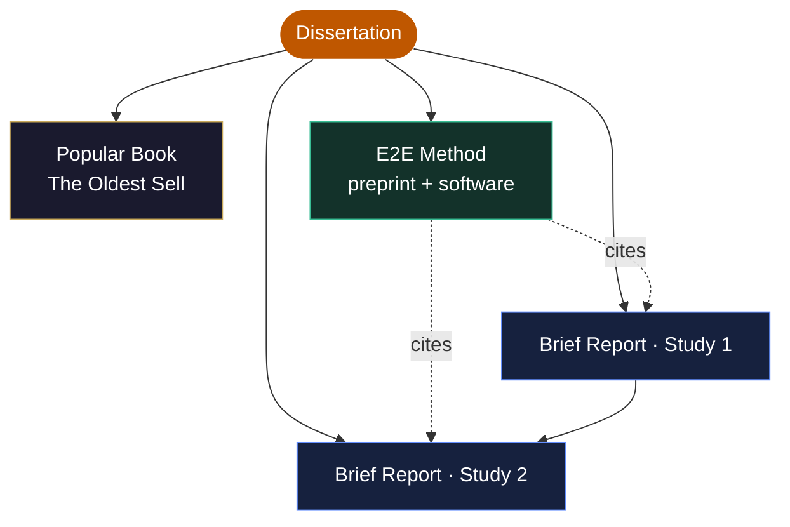

<div align="center">

# Alcohol Marketing on Social Media During the COVID-19 Pandemic

### Historical Perspectives, Modern Evidence, and Future Regulation

**A doctoral dissertation and its open research toolkit**

**Jacob Edward Thomas, PhD** &nbsp;·&nbsp; The University of Texas at Austin &nbsp;·&nbsp; 2025

<br>


<br><br>

[The Research](#the-research) &nbsp;·&nbsp; [The Method](#the-e2e-methodology) &nbsp;·&nbsp; [The Tools](#two-implementations) &nbsp;·&nbsp; [The Deliverables](#the-deliverables) &nbsp;·&nbsp; [Reproduce](#reproduce) &nbsp;·&nbsp; [Cite](#citation)

</div>

---

This repository is the complete, reproducible footprint of a seven-year, mixed-methods
dissertation: the source document, the novel computational method it produced, two working
implementations of that method, and a suite of publication-ready deliverables that translate
the work for distinct audiences — researchers, policymakers, and the public.

| | |
|---|---|
| **The research** | A three-lens investigation of how the alcohol industry marketed on social media during COVID-19 — and how that behavior echoes a century of technological adaptation. |
| **The method** | **E2E (Embedding-to-Explanation) Topic Modeling** — a hybrid pipeline that pairs density-based clustering with large language models to turn raw text into human-readable themes. |
| **The tools** | Two implementations of E2E: a zero-install [browser app](e2e-topic-modeler/) and a research-grade [Python package](e2e/). |
| **The deliverables** | A popular-history book, a methods preprint, two brief reports, and an [interactive portfolio piece](deliverables/dissertation_dissection.html) — all generated from code. |

---

## The Research

> This dissertation examines alcohol industry marketing on social media during the COVID-19
> pandemic through three complementary lenses: **historical perspectives, modern evidence, and
> future regulation.** Two original studies analyzed nearly **6,000 tweets** from major alcohol
> brands and over **486,000 tweets** from Twitter users before, during, and after the initial
> COVID-19 lockdowns (January 2019 – July 2021).

### Study 1 — What the industry said

Topic modeling, sentiment analysis, and AI-based classification surfaced **five primary marketing
themes.** Three rose sharply during lockdowns, and the pandemic-emphasized themes carried
measurably stronger emotional language — consistent with appeals to heightened psychological
vulnerability.

| Marketing theme | Change during lockdown | Persisted after lockdown |
|---|:--:|:--:|
| Alcohol Delivery & Isolation Drinking | **+91.2%** | Yes |
| Restaurant Support (corporate social responsibility) | **+189.5%** | — |
| Social Media Promotions | **+150.0%** | Yes |

### Study 2 — How it spread

A cross-lagged panel model tested influence in both directions between brand tweets and
user-generated content. The result was a single, **unidirectional pathway:**

```text
   Alcohol-brand tweets                          User-generated tweets
   (delivery + isolation drinking)   ──────▶      (similar content, later)

   (no significant reverse pathway)  ──────✗
```

Increased potential exposure to brand tweets promoting alcohol delivery and isolation drinking
**predicted subsequent increases in similar user content** — but not the reverse. Industry
messaging led; the public followed.

### The regulatory argument

The empirical findings align with the historical record and motivate a concrete framework:

- **Platform-level interventions** — content moderation, enhanced age verification, algorithmic transparency.
- **Industry accountability** — mandatory reporting, liability frameworks, corporate social responsibility standards, and crisis-marketing codes.

<sub>**Committee:** Keryn E. Pasch (Supervisor) · Alexandra Loukas · Miguel Pinedo · Dhiraj Murthy &nbsp;|&nbsp; 304 pages · 3 lenses · 7 years</sub>

---

## The E2E Methodology

Study 1 required discovering themes in thousands of tweets *without* hand-labeling them first.
The answer was **Embedding-to-Explanation (E2E) Topic Modeling** — a pipeline that lets statistics
find the structure and lets a language model explain it.


1. **Embed** — documents become dense semantic vectors.
2. **Reduce** — UMAP compresses those vectors while preserving neighborhood structure.
3. **Cluster** — HDBSCAN finds clusters of varying density and flags outliers as noise.
4. **Name** — representative documents go to an LLM *K* times; the majority-vote name wins (democratic naming).
5. **Classify** — every document is assigned to a discovered theme by the LLM.

The principle is the same in both implementations; the engineering differs by environment.

| Stage | Browser App | Python Pipeline |
|---|---|---|
| Embedding | Voyage AI (`voyage-3`) | SentenceTransformer (`all-MiniLM-L6-v2`) |
| Reduction | UMAP (cosine) | UMAP |
| Clustering | HDBSCAN (EOM extraction) | HDBSCAN + `c_v` coherence search |
| Naming | Claude — 5 votes | GPT-4o — 5,000 votes |
| Classification | Claude | GPT-4o |
| Optimization | `min_cluster_size` (auto/manual) | 50 iterations × 24 topic solutions = **1,200 candidate models** |

---

## Two Implementations

<table>
<tr>
<td width="50%" valign="top">

### [E2E Topic Modeler](e2e-topic-modeler/) — Web App

A browser-based tool that runs the **entire pipeline client-side** — including a from-scratch
JavaScript implementation of UMAP and HDBSCAN — and proxies only the embedding and LLM calls
through a Cloudflare Worker.

- Upload a CSV, get labeled topics and a cluster visualization.
- No coding required; no data leaves the browser except for the model API calls.
- **Stack:** HTML/CSS/JS · Cloudflare Pages + Worker · Voyage AI · Claude.

</td>
<td width="50%" valign="top">

### [E2E Python Pipeline](e2e/) — Research Package

The production-grade implementation used for the dissertation, with full hyperparameter
optimization and human-in-the-loop validation (>85% agreement).

```bash
pip install -e e2e/
e2e run data.csv \
  --text-column text \
  --domain-context "tweets about alcohol" \
  --n-iterations 50 --n-votes 100
```

**Stack:** BERTopic · SentenceTransformer · UMAP · HDBSCAN · OpenAI GPT-4o.

</td>
</tr>
</table>

---

## The Deliverables

A dissertation is one unified work; its findings reach further when dissected into the right
formats. Each deliverable below is **generated from code** for full reproducibility.

| Deliverable | Audience | File | Generator |
|---|---|---|---|
| *The Oldest Sell* — illustrated popular history of alcohol marketing | Public | [`the_oldest_sell.docx`](deliverables/the_oldest_sell.docx) | `generate_book.py` |
| E2E methodology paper (preprint) | Computational researchers | [`e2e_methods_paper.docx`](deliverables/e2e_methods_paper.docx) | `generate_methods_paper.py` |
| Brief Report — Study 1 (themes & prevalence) | Health scientists, policymakers | [`brief_report_study1.docx`](deliverables/brief_report_study1.docx) | `generate_brief_report_1.py` |
| Brief Report — Study 2 (cross-lagged influence) | Health scientists, policymakers | [`brief_report_study2.docx`](deliverables/brief_report_study2.docx) | `generate_brief_report_2.py` |
| **Interactive dissection** — visual portfolio | Everyone | [`dissertation_dissection.html`](deliverables/dissertation_dissection.html) | hand-authored |

The publication strategy is intentionally interconnected: the method preprint establishes
priority and is cited by both brief reports; Study 2 builds on Study 1; the book provides
historical context for all of it.



> **Tip:** `deliverables/dissertation_dissection.html` is a self-contained, animated scrollytelling
> page (UT-Austin burnt-orange theme). GitHub won't render it inline — clone the repo and open the
> file in any browser.

---

## Reproduce

**Rebuild every document deliverable** from source:

```bash
pip install python-docx PyMuPDF
python3 generate_book.py
python3 generate_methods_paper.py
python3 generate_brief_report_1.py
python3 generate_brief_report_2.py
```

**Run the web app locally** (see [`e2e-topic-modeler/README.md`](e2e-topic-modeler/README.md) for keys):

```bash
cd e2e-topic-modeler/worker
ANTHROPIC_API_KEY=... VOYAGE_API_KEY=... npx wrangler dev   # API proxy on :8787
cd ../public && python3 -m http.server 8080                 # static site on :8080
```

**Run the Python pipeline** (see [`e2e/README.md`](e2e/README.md)):

```bash
pip install -e e2e/
OPENAI_API_KEY=... e2e run your_corpus.csv --text-column text
```

---

## Repository Structure

```text
Dissertation/
├── README.md                        # You are here
├── LICENSE                          # MIT
├── THOMAS-PRIMARY-2025.pdf          # Source dissertation (304 pp.)
├── dissertation_full.txt            # Full text extraction
│
├── deliverables/                    # Generated research outputs
│   ├── the_oldest_sell.docx        # Illustrated popular history (28 figures)
│   ├── e2e_methods_paper.docx
│   ├── brief_report_study1.docx
│   ├── brief_report_study2.docx
│   └── dissertation_dissection.html # Interactive portfolio piece
│
├── generate_*.py                    # Deliverable generators (python-docx + PyMuPDF)
│
├── e2e/                             # E2E Python research pipeline
│   ├── e2e/                         #   preprocessing · modeling · naming
│   │   └── ...                      #   · classifier · pipeline · cli
│   ├── setup.py
│   └── README.md
│
└── e2e-topic-modeler/               # E2E browser app (Cloudflare)
    ├── public/                      #   static site (UMAP + HDBSCAN in JS)
    ├── worker/                      #   Cloudflare Worker (API proxy)
    └── README.md
```

---

## Citation

```bibtex
@phdthesis{thomas2025alcohol,
  author = {Thomas, Jacob Edward},
  title  = {Alcohol Marketing on Social Media During the COVID-19 Pandemic:
            Historical Perspectives, Modern Evidence, and Future Regulation},
  school = {The University of Texas at Austin},
  year   = {2025},
  month  = {August},
  type   = {PhD dissertation}
}

@software{thomas2025e2e,
  author = {Thomas, Jacob Edward},
  title  = {{E2E}: Embedding-to-Explanation Topic Modeling},
  year   = {2025},
  note   = {A BERTopic + LLM pipeline for topic discovery and classification},
  url    = {https://github.com/jethomasphd/dissertation}
}
```

---

## License

Released under the [MIT License](LICENSE). The dissertation document
(`THOMAS-PRIMARY-2025.pdf`) and its extracted text remain © 2025 Jacob Edward Thomas, all rights
reserved; the code, tools, and generated deliverables are MIT-licensed.

<div align="center">
<br>
<sub><b>Jacob Edward Thomas, PhD</b> &nbsp;·&nbsp; The University of Texas at Austin &nbsp;·&nbsp; 2025</sub>
</div>
